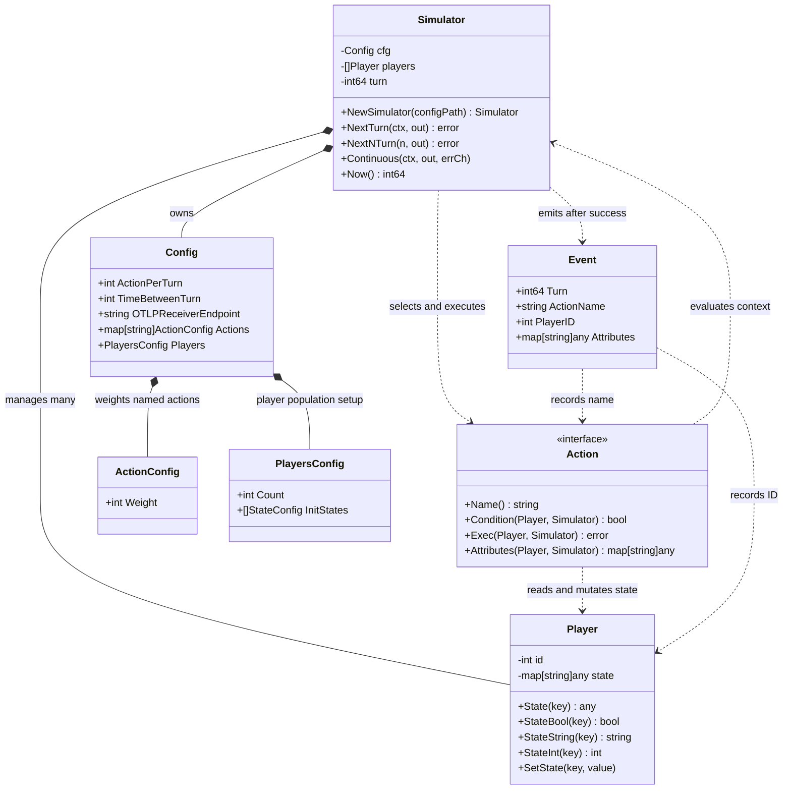
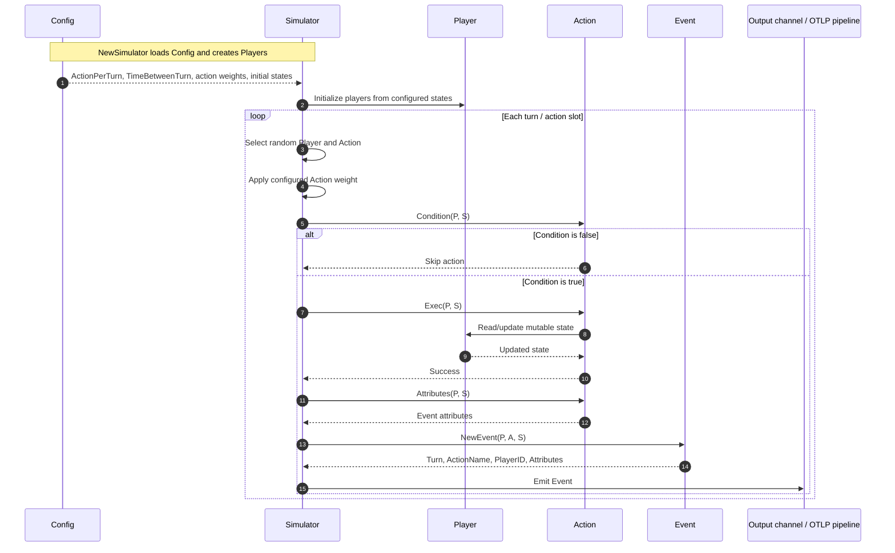

# simulator

A lightweight Go package for simulating large numbers of concurrent "players" that perform weighted, state-dependent actions over discrete turns.  
Useful for generating realistic event streams (e.g. for load testing, observability pipelines, or product analytics) without a real backend.

## Features

- Configurable number of players and initial state distributions
- Weighted random action selection + per-action conditions
- Mutable player state (`map[string]any`)
- Emits structured `Event`s (turn, action name, player ID, attributes)
- Supports single-turn, multi-turn, and continuous simulation
- Optional OTLP receiver endpoint for telemetry export

## Installation

```bash
go get github.com/jimtang2/simulator
```

(For local development with the companion `simulator-actions` package, use a `go.work` file or a `replace` directive.)

## Quick Start

```go
package main

import (
	"context"
	"fmt"
	"time"

	"github.com/jimtang2/simulator"
	// blank-import extra actions if desired
	// _ "github.com/jimtang2/simulator-actions/cex"
)

func main() {
	s, err := simulator.NewSimulator("config.yaml")
	if err != nil {
		panic(err)
	}

	out := make(chan simulator.Event, 1024)
	ctx, cancel := context.WithTimeout(context.Background(), 5*time.Second)
	defer cancel()

	go func() {
		for e := range out {
			fmt.Println(e)
		}
	}()

	// Run continuously until context is cancelled
	errCh := make(chan error, 1)
	go s.Continuous(ctx, out, errCh)

	<-ctx.Done()
	fmt.Println("simulation finished")
}
```

### Minimal config.yaml

```yaml
action_per_turn: 100
time_between_turn: 50          # ms

players:
  count: 1000
  init_states:
    - name: brand_new
      weight: 30
      state:
        onboarded: false
        logged_in: false
    - name: active
      weight: 70
      state:
        onboarded: true
        logged_in: true

actions:
  onboarding:
    weight: 10
  login:
    weight: 30
  logout:
    weight: 20
```

## Core Concepts

#### Class Diagram: Structure and Ownership



#### Sequence Diagram: One Simulated Action



Built-in actions: `onboarding`, `login`, `logout`.  
Additional actions can be registered with `simulator.AddAction(...)` or via blank imports from companion packages.

## API Summary

```go
s, err := simulator.NewSimulator(cfgPath)

s.NextTurn(ctx, out)          // one turn
s.NextNTurn(n, out)           // n turns (with sleep)
s.Continuous(ctx, out, errCh) // runs until ctx cancelled
```

## License

MIT